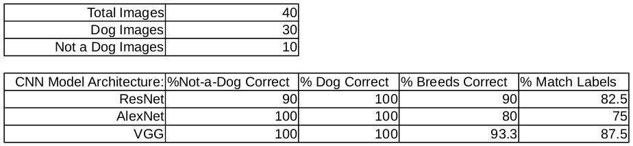
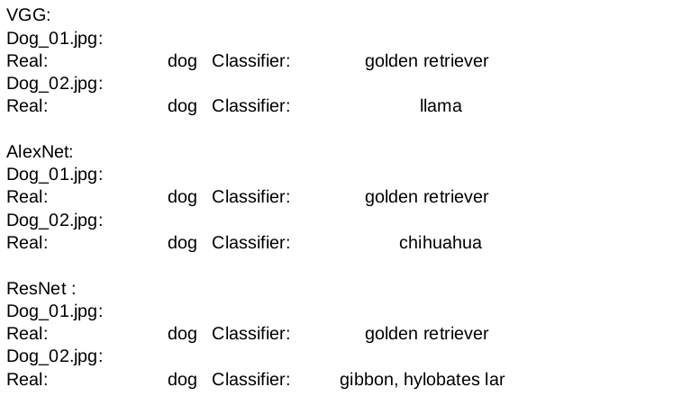
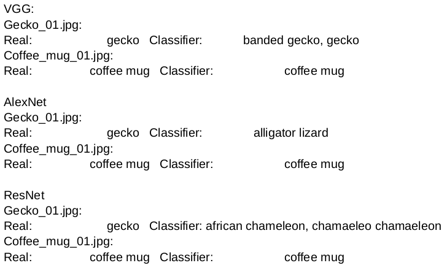

# Image Classification for a City Dog Show

# Project Goal
In this project a created image classifier is used to identify dog breeds. 

# Description:

A city is hosting a citywide dog show in need of volunteers to help the organizing committee with contestant registration. Every participant that registers must submit an image of their dog along with biographical information about their dog. The registration system tags the images based upon the biographical information.

Some people are planning on registering pets that aren’t actual dogs.

The project will shows the use of an already developed Python classifier to make sure the participants are dogs.


# Tasks:

- Determine which image classification algorithm works the "best" on classifying images as "dogs" or "not dogs".

- Determine how well the "best" classification algorithm works on correctly identifying a dog's breed.

- The term image classifier is a tool that has an input and an output. The Input is an image. The output determines what the image depicts. (for example: a dog). The fact that image classifiers do not always categorize the images correctly. 

- Time how long each algorithm takes to solve the classification problem. With computational tasks, there is often a trade-off between accuracy and runtime. The more accurate an algorithm, the higher the likelihood that it will take more time to run and use more computational resources to run.

For further clarifications, please check our [FAQ](https://github.com/udacity/AIPND-revision/blob/master/notes/project_intro-to-python.md)
here.

# Important Notes:

For this image classification task an image classification application using a deep learning model called a convolutional neural network (often abbreviated as CNN). CNNs work particularly well for detecting features in images like colors, textures, and edges; then using these features to identify objects in the images. A CNN that has already learned the features from a giant dataset of 1.2 million images called [ImageNet](http://www.image-net.org/). There are different types of CNNs that have different structures (architectures) that work better or worse depending on the specification criteria. Three different architectures (AlexNet, VGG, and ResNet) are explored and determine which has the best performance for the application described.

The classifier function is in classifier.py that will allows a CNNs to classify the images. The test_classifier.py file contains an example program that demonstrates how to use the classifier function. For this project, the focus will be on using Python to complete these tasks using the classifier function.

# Project Instructions
# Principal Objectives

1. Correctly identify which pet images are of dogs (even if breed is misclassified) and which pet images aren't of dogs.
     
2. Correctly classify the breed of dog, for the images that are of dogs.
     
3. Determine which CNN model architecture (ResNet, AlexNet, or VGG), "best" achieve the objectives 1 and 2.
     
4. Consider the time resources required to best achieve objectives 1 and 2, and determine if an alternative solution would have given a "good enough" result, given the amount of time each of the algorithms take to run.

The check_images.py is the program file that achieves the four objectives above by calling several functions.


# Program Outline

- Time program
    - Time Module is used to compute program runtime
- Program Inputs recieved from the user
    - Command line arguments are used to get user inputs
- Pet Image Labels
    - Pet images filenames are used to create labels
    - Pet image labels are stored in a data structure (e.g. dictionary)
- Classifier Labels Compared to Pet Image Labels
    - The Classifier function is used to classify the images and create the classifier labels
    - Classifier Labels compared to Pet Image Labels
    - Pet Labels, Classifier Labels, and their comparison are stored in a complex data structure (e.g. dictionary of lists)
- Classifying Labels as "Dogs" or "Not Dogs"
    - All Labels are classified as "Dogs" or "Not Dogs" using dognames.txt file
    - New classifications are stored in the complex data structure (e.g. dictionary of lists)
- Calculate the Results
    - Labels and their classifications are used to determine how well the algorithm worked on classifying images
- Results are printed

The above is repeated for each of the three image classification algorithms.

# Timing Code

 start_time is implemented to measure total program runtime within the check_images.py

- Timing code within the main() function 
    -    sleep() function is used to time the code adding different values of seconds.

# Outcome

This code calculates the runtime of the program. Specifically, this code measures how long each of the three algorithms will take to classify all the images in the pet_images folder.

# Importing Time Module

Timing the program or a portion of the program's code, allows one to compare the time costs associated with using different algorithms to solve a problem. Additionally, timing your code allows one to know the time costs associated with running a program using given computing resources.

To time code in python requires the import of the time() [function](https://docs.python.org/3/library/time.html#time.time) from the python [time module](https://docs.python.org/3/library/time.html#module-time). To simulate the program running for a certain period of time, the time module's sleep() [function](https://docs.python.org/2/library/time.html#time.sleep) is used. It will pause the program execution for a set number of seconds.

Since the time() and sleep() functions are the only functions needed from the time module, these two functions are the only ones imported using the import key word and not the entire time module. Only importing the functions from the module that are needed saves on memory (RAM) the program requires to execute.

Such an import would look like the following:

```python
#Imports time() and sleep() functions from time module
from time import time, sleep
```

# Using Time and Sleep Functions

To time your code you will need to:

- First, variable that records the start time (start_time) is created at the point where one wants to start timing the code

- Next, a variable that records the stop time (end_time), is created at the point one wants to stop timing the code

- Finally, the total runtime (tot_time) is calcualted by subtracting the start_time from end_time

- Note: the following:
    - tot_time will be the total time the code ran in seconds
    - sleep() is used in the code below to pause the program execution for 75 seconds. 

The code below demonstrates the use of time() and sleep().
```python

# Sets start time
start_time = time()

# Replace sleep(75) below with code you want to time
sleep(75)

# Sets end time
end_time = time()

# Computes overall runtime in seconds
tot_time = end_time - start_time

# Prints overall runtime in seconds
print("\nTotal Elapsed Runtime:", tot_time, "in seconds.")
```

# Formatting Time

To format runtime into a nice format like hh:mm:ss where:

- hh is two digit hours indicator
- mm is two digit minutes indicator
- ss is two digit seconds indicator

Recall the following regarding formatting time in seconds within python:

- 3600 seconds in an hour
- 60 seconds in a minute
- [/](https://docs.python.org/3/library/operator.html#operator.truediv) (division operator) with int() [function](https://docs.python.org/3/library/functions.html#int) will return only the whole number part of a division
- [%](https://docs.python.org/3/library/operator.html#operator.mod) (modulo operator) returns the remainder of a division
- str() [function](https://docs.python.org/3/library/functions.html#func-str) converts numeric values into strings
- Lesson Data Types and Operators: Arithmetic Operators and Integers and Floats will help with formatting time in python.  

Using the information above provides the following format of total runtime, as tot_time:

- hours = int( (tot_time / 3600) )
- minutes = int( ( (tot_time % 3600) / 60 ) )
- scconds = int( ( (tot_time % 3600) % 60 ) )
     

Below you will find code that will print the runtime in the format hh:mm:ss:

```python
#Prints overall runtime in format hh:mm:ss
print("\nTotal Elapsed Runtime:", str( int( (tot_time / 3600) ) ) + ":" +
          str( int(  ( (tot_time % 3600) / 60 )  ) ) + ":" + 
          str( int(  ( (tot_time % 3600) % 60 ) ) ) ) 
```

# Note

Instead of rounding to the nearest second, our code using the int() function and will truncate the value of seconds. This means if your Total Runtime: 4.519087974567, then it would be formatted to Total Runtime: 0:0:4. If you instead want to round to the nearest second, you will want to replace the int() [function](https://docs.python.org/3/library/functions.html#int) with the round() [function](https://docs.python.org/3/library/functions.html#round) in calculating the number of seconds above.


# Command Line Arguments

get_input_args() function within get_input_args.py is implemented to create & retrieve the command line arguments. argparse is used to retrieve three command line arguments from the user. (Argparse makes it easy to write user-friendly command-line interfaces).


# Expected Outcome

The code will input the three command line arguments from the user. The check_command_line_arguments function within check_images.py checks the code.

The following is tested:
   - Entering no command line arguments when running check_image.py from the terminal window. This results in the default values being printed.
   - Entering in values of your choosing for the command line arguments when you run check_image.py from the terminal window. This should result in the values you entered being printed.


# Purpose

The purpose of command line arguments is to provide a way for your programs to be more flexible by allowing external inputs (command line arguments) to be input into a program. The key is that these external arguments can change as to allow more flexibility in the program.


# Usage of Argparse:

The argparse module to input the following external inputs into our program check_image.py. W

Below are the three external inputs your check_image.py program will need to retrieve from the user along with the suggested default values each should have.

   - Folder that contains the pet images
        pet_images/

   - The CNN model architecture to use
        resnet, alexnet, or vgg (pick one as the default). You will find them in classifier.py.

   - The file that contains the list of valid dognames
        dognames.txt

The get_input_args function will need to create an argument parser object using [argparse.ArgumentParser](https://docs.python.org/3/library/argparse.html#argparse.ArgumentParser) and then use the add_argument [method](https://docs.python.org/3/library/argparse.html#adding-arguments) to allow the users to enter in these three external inputs from above.

Below is an example of creating an argument parser object and then using add_argument to add an argument that's a path to a folder and a second argument that's an integer.

```python

# Creates Argument Parser object named parser
parser = argparse.ArgumentParser()

# Argument 1: that's a path to a folder
parser.add_argument('--dir', type = str, default = 'pet_images/', 
                    help = 'path to the folder of pet images') 

```
Below you will find an explanation of the inputs into add_argument.

# Arguments:

- --dir = The variable name of the argument (here it's dir)

- type = The type of the argument (here it's a string)

- default = The default value (here it's 'pet_images/')

- help = The text that will appear if the user types the program name and then -h or --help. This allows the user to understand the what's expected an argument's value

# Accessing Argparse Arguments

To access the arguments passed into the program through your argparse object, parse_args [method](https://docs.python.org/3/library/argparse.html#the-parse-args-method) is used. The code below demonstrates how to access the arguments through the argparse extending the example above.

a variable is assigned to parse_args and then that variable is used to access the arguments of the argparse object. If  the argparse object is created within a function, return parse_args instead of assigning a variable to it. Also note that the variable in_args points to a collection of the command line arguments.

This means to access the one we created in the code above, there is a reference to the collection variable name in_args then the command line argument variable name dir is specified. For this example, it would be in_args.dir, where in_args is the collection variable name and dir refers to the command line argument variable name. Notice that a dot (.) separating the two variable names is used. The code below shows the assignment of in_args to the parser and then accessing the value of in_args.dir with the print statement.
```python

# Assigns variable in_args to parse_args()
in_args = parser.parse_args()

# Accesses values of Argument 1 by printing it
print("Argument 1:", in_args.dir)
```

# Running a Program using command line arguments

To run a program like check_images.py, first open a terminal window within the Project Workspace. Next type the following and hit enter to run the program (this example - check_images.py). Because no command line arguments are specified after the program name (this example - check_images.py) this will use the default command line arguments that have been defined.

```python
python check_images.py 
```

To run a program like check_images.py using the command line argument --dir, first open a terminal window within the Project Workspace. Next type the following and hit enter to run the program (this example - check_images.py). Notice that all command line arguments are specified after the program name (this example - check_images.py) and they are indicated by the -- that proceeds their variable name (this example : dir) with the value following the variable name (in this example the string : pet_images/).

```python
python check_images.py --dir pet_images/
```

# Mutable Data Types and Functions

If a data type is mutable or immutable. The scope of immutable python data types in Variable Scope.

This concept will help you better understand how to use mutable data structures (like lists and dictionaries) within functions. 

# Creating Pet Image Labels

The get_pet_labels() function within get_pet_labels.py, creates pet image labels by creating a dictionary with key=filename and value=file label. get_pet_labels() is called by check_images.py It will be used later to check the accuracy of the classifier function.

The get_pet_labels() function within get_pet_labels.py will be creating the labels for the pet images, using the filenames of the pet images in the pet_images folder. These images filenames represent the identity of the pet in the image. The pet image labels are considered to represent the "truth" about the classification of the image. The get_pet_labels() function within get_pet_labels.py will return the Results Dictionary that will contain the pet image filenames and labels. The pet image filename is the key and a List that contains only the pet image label as the value for all 40 pet images in the pet_image folder.

-    Code for the function definition def get_pet_labels(): within get_pet_labels.py.
-        Comments and the docstring within get_pet_labels.py to implement get_pet_labels
-    Code within the main() function within check_images.py
-        Function call with in_arg.dir to specify the appropriate directory.

# Expected Outcome

The code returns a dictionary with the pet image filename as the key and a List that contains only the pet image label as the value for all 40 pet images in the pet_image folder.

# Checking your code

The check_creating_pet_image_labels function within check_images.py will check the code by printing out the number of key-value pairs and the first 10 key-value pairs.

The results are visually checked:

-    The dictionary containing 40 key-value pairs (e.g. dictionary length is 40).
-    The pet image labels the following way:
     -    Lower case letters
     -    Single space separating each word
     -    Correct representation of the filenames (from the 10 key-value pairs)
     

# How to read Filenames from a Folder of Files

The folder pet_images/ contains 40 images that will twst the classifier algorithms. The filenames of the images in pet_images/ identify the animal in each image.

The labels are created by:

-    Reading all the files' names in the pet_image/ folder
-    Processing the filenames to create the pet image labels
-    Formating the pet image labels such that they can be matched to:
     -   The classifier function labels
     -   The dog names in dognames.txt

In the first task the function will need to read the filenames from a folder. To achieve this task you will need to only import the [listdir method](https://docs.python.org/3/library/os.html#os.listdir) from the [os python module](https://docs.python.org/3/library/os.html). The listdir method retrieves all filenames from the files within a folder. These filenames are returned from listdir as a list. The code below demonstrates how to perform this import and retrieval.

```python 

# Imports only listdir function from OS module 
from os import listdir  

# Retrieve the filenames from folder pet_images/
filename_list = listdir("pet_images/")

# Print 10 of the filenames from folder pet_images/
print("\nPrints 10 filenames from folder pet_images/")
for idx in range(0, 10, 1):
    print("{:2d} file: {:>25}".format(idx + 1, filename_list[idx]) )
```

# Creating a Dictionary of Lists (similar to the Results Dictionary)

The Python [Dictionary](https://docs.python.org/3/tutorial/datastructures.html#dictionaries) is the data structure used for the Pet Image filenames (as keys) and a List that contains the filenames associated labels (as values). The following are reasons for this data structure choice:

-    The key-value pairs of a dictionary are a logical choice because the need to process the same filenames (keys) with the classifier function and compare its returned labels to those of pet image (values)
-    Given an input key, retrieval of the associated value is quicker than retrieval from other data structures (e.g. lists).

# Dictionary Usage Review

The code below serves as a reference to help use Python dictionaries.

-    Creating an empty dictionary
-    Creating a dictionary that contains a List as the value.
-    Determines number of items in a dictionary
-    Adds key-value pairs to dictionary if key doesn't already exist in the dictionary
-    Iterates through a dictionary printing all key-value pairs in a dictionary

```python 

# Creates empty dictionary named results_dic
results_dic = dict()

# Determines number of items in dictionary
items_in_dic = len(results_dic)
print("\nEmpty Dictionary results_dic - n items=", items_in_dic)

# Adds new key-value pairs to dictionary ONLY when key doesn't already exist. This dictionary's value is
# a List that contains only one item - the pet image label
filenames = ["beagle_0239.jpg", "Boston_terrier_02259.jpg"]
pet_labels = ["beagle", "boston terrier"]
for idx in range(0, len(filenames), 1):
    if filenames[idx] not in results_dic:
         results_dic[filenames[idx]] = [pet_labels[idx]]
    else:
         print("** Warning: Key=", filenames[idx], 
               "already exists in results_dic with value =", 
               results_dic[filenames[idx]])

#Iterating through a dictionary printing all keys & their associated values
print("\nPrinting all key-value pairs in dictionary results_dic:")
for key in results_dic:
    print("Filename=", key, "   Pet Label=", results_dic[key][0])

```

# Pet Image File Format for Label Matching

Determine matches between the pet image labels and the classifier labels.  Below is a detailed description of the format the pet image filenames that will be used to create the pet image labels.

# Pet Image Files

The pet image files are located in the folder 'pet_images'. Some examples of the filenames are: Basenji_00963.jpg, Boston_terrier_02259.jpg, gecko_80.jpg, fox_squirrel_01.jpg

There are:

-    40 total images pet images
     -   30 images of dogs
     -   10 images of animals that aren't dogs
-    Name (label) of image (needed for comparison)
     -    contains upper and lower case letters
     -    contains one or more words to describe the image (label)
     -    words are separated by an underscore (_)

# Python functions to create Pet Image Labels

The best format for each pet image name would be:

    Label: with only lower case letters
    Blank space separating each word in a label composed of multiple words
    Whitespace characters stripped from front & end of label

Based upon the pet image filename format above, the following string functions are used to achieve the label format:

[lower()](https://docs.python.org/3/library/stdtypes.html#str.lower) - places letters in lower case only.
[split()](https://docs.python.org/3/library/stdtypes.html#str.split) - returns a list of words from a string, where the words have been separated (split) by the delimiter provided to the split function. If no delimiter is provide, splits on whitespace.
[strip()](https://docs.python.org/3/library/stdtypes.html#str.strip) - returns a string with leading & trailing characters removed. If no characters are provided, strips leading & trailing whitespace characters.
[isalpha()](https://docs.python.org/3/library/stdtypes.html#str.isalpha) - returns true only when a string contains only alphabetic characters, returns false otherwise.

Below are examples that demonstrate the use of the above string functions.
```python 

# Sets pet_image variable to a filename 
pet_image = "Boston_terrier_02259.jpg"

# Sets string to lower case letters
low_pet_image = pet_image.lower()

# Splits lower case string by _ to break into words 
word_list_pet_image = low_pet_image.split("_")

# Create pet_name starting as empty string
pet_name = ""

# Loops to check if word in pet name is only
# alphabetic characters - if true append word
# to pet_name separated by trailing space 
for word in word_list_pet_image:
    if word.isalpha():
        pet_name += word + " "

# Strip off starting/trailing whitespace characters 
pet_name = pet_name.strip()

# Prints resulting pet_name
print("\nFilename=", pet_image, "   Label=", pet_name)
```


# Classifying Images

The classify_images() function to create the classifier labels with the classifier function using in_arg.arch. Compare the labels, and create a dictionary of results (result_dic). Code within the check_images.py and classify_images.py

With this function the labels are created for the images using the classifier function. Additionally, the classifier's labels  are comapred to the pet image labels. Finally, the classifier generated labels are stored, and the comparison of labels in the results dictionary (complex data structure) that was returned by get_pet_labels function.

-    Code within the function def classify_images() as indicated by #TODO: 3 within classify_images.py
     -  Using the comments and docstring within classify_images.py to define classify_images
-    Code within the main() function within check_images.py indicated by #TODO: 3
     -   Replace the first None within the function call to classify_images with in_arg.dir and replace the last None in the function call with in_arg.arch

# Expected Outcome

The code returns a dictionary of lists with the pet image filename as the key and the value will be a list for all 40 pet images in the pet_image folder. This list will contain the following items:

-    Pet image label (index 0)
-    Classifier label (index 1)
-    Comparison of labels (index 2)

# Checking your code

The check_classifying_images function within check_images.py will checks the. This function prints out all the matches between the classifier and pet image labels and then all the non-matches between the labels.

The results are visually checked to show:

-    Matches between Classifier and Pet Image Labels are real matches
-    Non-matches between Classifier and Pet Image Labels are real non-matches
-    The number of matches added to the number of non-matches totals 40, to account for all 40 images in pet_images folder

# Testing the classifier function

The classifier functio function is located in the classifier.py program and serves the purpose of classifying images. The classifeir function can be tested calling the test_classifier.py program following the instructions below. The test_classifier.py program was used to see how to use the classifier function within classify_images.py. 

```python
    python test_classifier.py 
```

The image of the collie should be correctly classified as a collie.

Details on test_classifier.py program:

-    The classifier function is imported into the classify_images.py program

-    The classifier function takes in two arguments:
     -   The full image path (includes folder and filename).
          -  Folder and filename stored as separate variables, can be concatenated together into a single string.
     -   The CNN model architecture.
            Must be resnet, vgg or alexnet

# Classifier Label Format for Label Matching

The classify_images() function will need to be able to determine matches between the pet image labels and the labels the classifier function returns. Below is a detailed description of the format of the classifier labels.

# Classifier Labels

Labels are located in file imagenet1000_clsid_to_human.txt.

Label Information:

-    1000 total labels
     -   associated to 118 different dog breeds
            dog breeds are associated to Ids 151: Chihuahua to 268: Mexican hairless
     -   associated to 882 images that aren't dogs
-    label format:
     -   a mixture of upper and lower case letters
     -   a single word that identifies the image
          -  Ex. beagle
     -   multiple words separated by spaces that identify the image
            Ex. German shorthaired pointer
     -   a number of different terms separated by a comma (,) that all identify the same image
          -  Ex. cocker spaniel, English cocker spaniel, cocker

# Comparing Pet Image Labels to Classifier Labels

In the Creating Pet Image Labels concept the pet image labels are formated to be:

-    Label composed of all lower case letters
-    Blank space separating each word in label composed of multiple words
-    Whitespace characters stripped from front & end of label
-    Examples:
     -   beagle
     -   cocker spaniel
     -   polar bear

Looking at the classifier label format above, the only processing that was done is to put all the letters in lower case and to strip off any leading/trailing whitespace characters. The in operation can be used to determine if the pet image label matches one of the terms that compose the classifier label. The pet image labels are always only one term (even if multiple words make up that term). Therefore, if (using the in operation) the pet image label matches one term in the term (or terms) that make up a classifier label - then there's a match.

To accomplish these formatting and matching tasks use the following string functions:

[lower()](https://docs.python.org/3/library/stdtypes.html#str.lower) - places letters in lower case only.
[strip()](https://docs.python.org/3/library/stdtypes.html#str.strip) - returns string with leading & trailing characters removed. If no characters are provided strips leading & trailing whitespace characters.
[in operation](https://docs.python.org/3/library/stdtypes.html#common-sequence-operations) - returns True when a string exists within another string, otherwise returns False.

# Data Structure for Results

# Compound Data Structures

The get_pet_labels function returns a dictionary with the filenames as the keys and a list that contains only the pet image labels as the values. For the classify_images function, you can use the [extend](https://docs.python.org/3.1/tutorial/datastructures.html) list function to add both the classifier label and the comparison to the results dictionary simultaneously.

The reason behind the compound data structure consisting of a dictinary of lists  is:

The below functions require the format
-    check_creating_pet_image_labels
-    check_classifying_images
-    check_classifying_labels_as_dogs
-    check_calculating_results
Also
-    It's easier to access elements of the list using index values
-    The [sum()](https://docs.python.org/3/library/functions.html#sum) function with [slicing](https://docs.python.org/3/tutorial/introduction.html#lists) is used later to quickly classify the results

# Computing the Results

For this function the input will be the results_dic dictionary that contains:

    The filenames as keys
    A list whose only item is the pet image label.

1) Iterate through this dictionary (results_dic) processing each pet image (filename) with the classifier function to get the classifier label.

2) Compare the pet image and classifier labels to determine if they match.

3) Add the results to the results dictionary (results_dic).

Since the reuslts dicionary is a Mutable Data Type it is not returned from the classify_images function.

The folllowing coding recommendations were followed to prevent issues with classify_images:

-    With the classifier function, be certain to concatenate the images_dir with the filename to represent the full path to each pet image file.
-    Put classifier labels in all lower case letters, stripping leading and trailing whitespace from the label.
     - results_dic will have the following format:
     -   key = pet image filename (ex: Beagle_01141.jpg)
     -   value = List with:
         -   index 0 = Pet Image Label (ex: beagle)
         -   index 1 = Classifier Label (ex: english foxhound)
         -   index 2 = 0/1 where 1 = labels match , 0 = labels don't match (ex: 0)
           example_dictionary = {'Beagle_01141.jpg': ['beagle', 'english foxhound', 0]}
-    To initialize a key in results_dic, use the assignment operator ( = ) to assigning the value of a list.
-    To add a single item to the list of an existing key in results_dic, append to the list using either += operator or the append function.
-    To add multiple items simultaneously to the list of an existing key in results_dic, use the extend list function.

The code below demonstrates the difference between initializing a key-value pair and adding to the list of an existing key-value pair. The code also demonstrates how to iterate through a dictionary of lists to access each element of the list.

```python 
# Defining lists to populate dictionary 
filenames = ["Beagle_01141.jpg", "Beagle_01125.jpg", "skunk_029.jpg" ]
pet_labels = ["beagle", "beagle", "skunk"]
classifier_labels = ["walker hound, walker foxhound", "beagle",
                     "skunk, polecat, wood pussy"]
pet_label_is_dog = [1, 1, 0]
classifier_label_is_dog = [1, 1, 0]


# Defining empty dictionary
results_dic = dict()

# Populates empty dictionary with both labels &indicates if they match (idx 2)
for idx in range (0, len(filenames), 1):
    # If first time key is assigned initialize the list with pet & 
    # classifier labels
    if filenames[idx] not in results_dic:
        results_dic[filenames[idx]] = [ pet_labels[idx], classifier_labels[idx] ]

    # Determine if pet_labels matches classifier_labels using in operator
    # - so if pet label is 'in' classifier label it's a match
    # ALSO since Key already exists because labels were added, append 
    # value to end of list for idx 2 
    # if pet image label was FOUND then there is a match 
    if pet_labels[idx] in classifier_labels[idx]:
        results_dic[filenames[idx]].append(1)

    # if pet image label was NOT found then there is no match
    else:
        results_dic[filenames[idx]].append(0)

# Populates dictionary with whether or not labels indicate a dog image (idx 3&4)
for idx in range (0, len(filenames), 1):
    # Key already exists, extend values to end of list for idx 3 & 4
    results_dic[filenames[idx]].extend(pet_label_is_dog[idx], 
                                       classifier_label_is_dog[idx])

# Iterates through the list to print the results for each filename
for key in results_dic:
    print("\nFilename=", key, "\npet_image Label=", results_dic[key][0],
          "\nClassifier Label=", results_dic[key][1], "\nmatch=",
          results_dic[key][2], "\nImage is dog=", results_dic[key][3],
          "\nClassifier is dog=", results_dic[key][4])                        

    # Provides classifications of the results
    if sum(results_dic[key][2:]) == 3:
        print("*Breed Match*")
    if sum(results_dic[key][3:]) == 2:
        print("*Is-a-Dog Match*")
    if sum(results_dic[key][3:]) == 0 and results_dic[key][2] == 1:
        print("*NOT-a-Dog Match*")
```


# Classifying Labels as Dogs

The adjust_results4_isadog() function in adjust_results4_isadog.py adjusts the results of dictionary(result_dic) to determine if the classifier correctly classified images as 'a dog' or 'not a dog'. The adjust_results4_isadog() is called by check_images.py.

# Code to Edit

djust_results4_isadog() function in adjust_results4_isadog.py:

-    Read in the dog names from dognames.txt file into a data structure (like a dictionary)
-    Compare the dog names to the classifier and pet image labels in the results dictionary
-    Adjust the results dictionary to indicate whether or not these labels indicate the image is 'of-a-dog'.

    Note that the adjust_results4_isadog function will change the results dictionary, but because dictionaries are mutable his dictionary does not need to be returned.


# Expected Outcome

djust_results4_isadog() function alters the results dictionary (a dictionary of lists) with the pet image filename as the key and the value will be a list for all 40 pet images in the pet_image folder. This list for each key will now contain two additional items: whether the pet image label is of-a-dog (index 3) and whether the classifier label is of-a-dog (index 4).

# Checking your code

The check_classifying_labels_as_dogs function within check_images.py checks the code. This function will print out all the matches between the classifier and the pet image labels and all the non-matches between the labels.

The results are visually checked to show:

-    Matches between Classifier and Pet Image Labels have both labels classified as "dogs" or "not dogs" as appropriate for the labels.
-    Non-matches between Classifier and Pet Image Labels correctly classify each label as "dogs" or "not dogs"
-    The number of matches added to the number of non-matches totals 40, to account for all 40 images in pet_images folder.

# principle objectives _1_ and _2_:

1.    Correctly identify which pet images are of dogs (even if breed is misclassified) and which pet images aren't of dogs.

2.    Correctly classify the breed of dog for the images that are of dogs.
     

To achieve objectives _1_ and _2_, the program will have to be able to identify if labels from both the classifier function and the pet images are of "a dog" or "not a dog". To be able to classify the labels as "dogs" or "not dogs", the program compares the labels to the list of dogs contained in the dognames.txt file.

This dognames.txt file was created from the formatted labels (lower case, whitespace trimmed, etc.). Therefore, when comparing dog names (from dognames.txt) to the labels:

-    if there is a match between dog name and label, the label "is a dog"
-    if there isn't a match between dog name and label, the label "is not a dog"

Details about dognames.txt:

There are:

-    One dog breed name per line
-    223 dog breeds named
-    All possible dog breeds that can come from the classifier function and pet image labels
-    Classifier Function Labels:
     -   Lines 1 (chihuahua) to 118 (mexican hairless), these should match classifier returned labels as long as those labels are in all lower case letters and have whitespace characters trimmed from the ends.
-    Pet Image Labels:
      -  Should match the following lines as long as the labels are in all lower case letters, whitespace has been trimmed from the ends, and there is a single space separating the words of a dogs name (if it's composed of multiple words).

Reading In Dogsname.txt

The first task of the adjust_results4_isadog was to read in all the dog names and store them in a data structure. Given the details above, the most ideal data structure for our dog names is a dictionary with the key as the dog name and a value of 1 (arbitrary value). The reasoning behind this choice is because the speed of the look-up of a dictionary. Since we know the labels should match the dog name exactly if there is a match; we can simply look for the label as a key within the dog names dictionary to discover all labels that are dogs. If the label isn't found as a key in the dog names dictionary, then we know that label is not a dog.

The following coding recommendation was follwoed as to prevent issues with adjust_results4_isadog:

-    Define the dognames_dic prior to opening the dognames.txt file for reading
-    Use [rstrip()](https://docs.python.org/3/library/stdtypes.html#str.rstrip) to strip off newline characters from each line read from dognames.txt
-    If a dog name already exists in dognames_dic print a Warning statement because you shouldn't find any duplicate dog names in dognames.txt

# Adjusting Results Dictionary

Once you have read in the dog names into dognames_dic, you will need to adjust the results dictionary (results_dic) to account for when labels were correctly or incorrectly classified as dogs.

Review section Classifying Labels as Dogs to review how to iterate through the results dictionary to append values onto the list that is the value for each key in the results dictionary. If you want to append both values at the same time, you will need to use the [extend](https://docs.python.org/3.1/tutorial/datastructures.html) list function to add both index 3 and index 4 to the results_dic simultaneously.

results_dic will have the following adjusted format:

-    key = pet image filename (ex: Beagle_01141.jpg)
-    value = List with:
     -   index 0 = Pet Image Label (ex: beagle)
     -   index 1 = Classifier Label (ex: english foxhound)
     -   index 2 = 0/1 where 1 = labels match , 0 = labels don't match (ex: 0)
     -   index 3 = 0/1 where 1= Pet Image Label is a dog, 0 = Pet Image Label isn't a dog (ex: 1)
     -   index 4 = 0/1 where 1= Classifier Label is a dog, 0 = Classifier Label isn't a dog (ex: 1)
-    example_dictionary = {'Beagle_01141.jpg': ['beagle', 'walker hound, walker foxhound', 0, 1, 1]}


# Calculating Results

The calculates_results_stats() function in the calculates_results_stats.py calculates the results of run and put statistics in a results statistics dictionary (results_stats_dic). The calculates_results_stats() function is called by check_images.py.

The function inputs the results dictionary to create a dictionary of results statistics. This results statistics dictionary will contain the statistic's name as the key and the value will simply be the statistic's numeric value.

The dictionary is created as the first line in the function and returns it's value with the last line in the function.

# Expected Outcome

This code provides the counts and percentages that will be used to answer the questions below. The percentages provided by the results_stats dictionary will answer objectives 1 and 2. The counts will be used to compute the percentages.

The check_calculating_results function within check_images.py will check the code by recalculating the following results statistics (counts and percentages) and comparing them to the results statistics that are calculated in calculates_results_stats() and stored within the results statistics dictionary.

Results Statistics checked:

-    Counts:
     -   Number of Images
     -   Number of Dog Images
     -   Number of "Not-a" Dog Images
-    Percentages:
     -   % Correctly Classified Dog Images
     -   % Correctly Classified "Not-a" Dog Images
     -   % Correctly Classified Breeds of Dog Images

# Checking your code

A visuall check is performed on the the results from this checking code for these six statistics above match the results  computed with calculates_results_stats within calculates_results_stats.py.


# Principle Objectives _1_ and _2_:

1.    Correctly identify which pet images are of dogs (even if breed is misclassified) and which pet images aren't of dogs.
2.    Correctly classify the breed of dog, for the images that are of dogs.
     

To achieve objectives _1_ and _2_, the program calculates the following percentages based upon the results of comparing the labels contained within the results dictionary.

The results dictionary will have the following format:

-    key = pet image filename (ex: Beagle_01141.jpg)
-    value = List with:
     -   index 0 = Pet Image Label (ex: beagle)
     -   index 1 = Classifier Label (ex: english foxhound)
     -   index 2 = 0/1 where 1 = labels match , 0 = labels don't match (ex: 0)
     -   index 3 = 0/1 where 1= Pet Image Label is a dog, 0 = Pet Image Label isn't a dog (ex: 1)
     -   index 4 = 0/1 where 1= Classifier Label is a dog, 0 = Classifier Label isn't a dog (ex: 1)
-    example_dictionary = {'Beagle_01141.jpg': ['beagle', 'walker hound, walker foxhound', 0, 1, 1]}

The calculations (counts & percentages) are stored in the results statistics dictionary. The same prefix will is used for all counts (e.g. n_) and percentages (e.g. pct_) in the statistic's name(key) as to make it easier to print all of them for each group.

The results statistics dictionary will have the following format:

-    key = statistic's name (e.g. n_correct_dogs, pct_correct_dogs, n_correct_breed, pct_correct_breed)
-    value = statistic's value (e.g. 30, 100%, 24, 80%)
-    example_dictionary = {'n_correct_dogs': 30, 'pct_correct_dogs': 100.0, 'n_correct_breed': 24, 'pct_correct_breed': 80.0}

Counts Computed from the Results dictionary for input into the Results Statistics dictionary:

-    Z: Number of Images
     -   length of results_dic, because filenames = key
-    A: Number of Correct Dog matches
     -   Both labels are of dogs: results_dic[key][3] = 1 and results_dic[key][4] = 1
-    B: Number of Dog Images
     -   Pet Label is a dog: results_dic[key][3] = 1
-    C: Number of Correct Non-Dog matches
     -   Both labels are NOT of dogs: results_dic[key][3] = 0 and results_dic[key][4] = 0
-    D: Number of Not Dog Images
     -   number images - number dog images --OR--
     -   Pet Label is NOT a dog: results_dic[key][3] = 0
 -   E: Number of Correct Breed matches
     -   Pet Label is a dog & Labels match: results_dic[key][3] = 1 and results_dic[key][2] = 1
 -   (Optional) Y: Number of label matches
      -  Labels match: results_dic[key][2] = 1

Compute a Summary of the Percentages from the Results Statistics dictionary counts:

-    Objective _1_a: Percentage of Correctly Classified Dog Images
     -   A Correctly classified dog images.
     -   B Number of dog images
     -   Percentage of correctly classified "dog" images: A/B * 100

-    Objective _1_b: Percentage of Correctly Classified Non-Dog Images
     -   C Correctly classified NOT a dog images.
     -   D Number of NOT a dog images
     -   Percentage of correctly classified "Non-dog" images: C/D * 100

-    Objective _2_: Percentage of Correctly Classified Dog Breeds
     -   E Correctly classified as a particular breed of dog images.
     -   B Number of dog images
     -   Percentage of correctly classified Dog Breed images: E/B * 100

-    (Optional): Percentage Label Matches ( regardless if they're a dog)
     -   Y Number of label matches
     -   Z Number of images
     -   Percentage of correctly Matched Images ( regardless if they are a dog): Y/Z * 100

Important Notes:

-    The counts are initialized to a value of zero before iterating through results dictionary. If certain criterion are met during the iteration of the results dictionary counters are incremented by 1.

-    The percentages (and total number of images) can be generated from the counts (see percentage & count calculations above); therefore, these values should be calculated after counts have been calculated by iterating through the results dictionary.

- A conditional statement is used to check that the number of "not-a-dog" images, is greater than zero, when calculating the percentage of correctly classified Non-Dog Images. If D is greater than zero C/D be computed; otherwise, it is set set to 0.

-    Because the Results Statistics dictionary is created inside of the function and is a mutable object, the dictionary is returned, at the end of the function.


# #TODO: 6 Printing The Results

The print_results() function within print_results.py prints a summary of the results (as well as incorrect classifications of dogs and breeds if requested). The print_results() function is called by print_results.py

The print_results() function inputs the results dictionary and the results statistics dictionary to print a summary of the results. Because this function allows one to print a list of incorrectly classified dogs and incorrectly classified breeds of dog, one needs to include the results dictionary.

# Expected Outcome

The print_results() function prints the summary of the results that will be used to answer objectives 1 and 2 of this project.

The output is visually checked to confirm the following:

 -   Running the program results in the statistics and counts being properly printed and formatted. Results from the code check for Calculating Results should match the values printed for those 6 statistics.
-    Leaving off the two default arguments in the function call to print_results, results in no misclassifications being printed (That's an expected default behavior).
-    Adding the values of True for the two default arguments in the function call to print_results, results in the misclassifications being printed (That's also an expected default behavior).

# Final Program Run

The program runs using batch processing to run the program for all three CNN model architectures. 
Project Workspace - Printing Results


# Printing Results

The first thing to be printed is a general statement that indicates which of the three CNN model architectures you are using. You can pass the information in the model as an input parameter to be able to print it.

The results are printed for overall count which will be the same for all three CNN model architectures. This can be done by calling for those counts using the appropriate key within a print statement.

-    Number of Images
-    Number of Dog Images
-    Number of "Not-a" Dog Images

Finally, results_stats dictionary is iterated to print out the statistic's name and value for all of the percentages (e.g. key that starts with the letter "p"). Recall the prefix (e.g. pct_) to all of the percentage statistics, so that they could all be printed out as a group.

Percentage Calculations:

-    % Correct Dogs
-    % Correct Breed
-    % Correct "Not-a" Dog
-    % Match (optional - this includes both dogs and not-a dog)

# Printing Misclassifications

This function allows one to optionally print cases of dog and breed misclassifications.

This optional feature is provided to allow improved debugging of the code. Additionally, this feature provides the ability to determine if there are certain breeds of dogs that the algorithms have difficulty identifying.
Default Arguments for Misclassification

The function print_results contains two default arguments for printing misclassified dogs and breeds. 

Default Arguments:

-    print_incorrect_dogs - defaults to False
-    print_incorrect_breed - defaults to False

# Purpose

The purpose of default arguments can be the following:

-    To provide a wider range of behaviors for a function, without having to code multiple (similar) functions.
-    To guarantee that certain arguments are always assigned a value within a function.
-    To provide a default behavior for a function.

# Misclassified Dogs

Labels are misclassified as dogs when both labels aren't in agreement regarding whether or not an image is of a dog.

Prior to iterating through the results dictionary to find dog misclassifications, the first check that the user will wants to print misclassified dogs and that dog misclassifications occurred with a conditional statement.

This check is done when:

-    User wants to print misclassifications:
     -   print_incorrect_dogs == True
-    Some dogs were misclassified:
     -   n_correct_dogs + n_correct_notdogs != n_images

If the check is True, then print the pet image and classifier labels for misclassified dogs when:

-    The labels disagree on whether or not an image is of a "dog"
     -   sum(results_dic[key][3:]) == 1

# Misclassified Breed's of Dog

Labels have a misclassification of breeds of dog when both labels indicate that the image is a dog; but, labels aren't in agreement regarding the dog's breed.

Prior to iterating through the results dictionary to find breed misclassifications, the first check that the user wants to print misclassified breeds and that breed misclassification occurred with a conditional statement.

This check is done when:

-    User wants to print misclassifications:
     -   print_incorrect_breed == True
-    Some breeds were misclassified:
     -   n_correct_dogs != n_correct_breed

If the check is True, then print the pet image and classifier labels for misclassified breeds when:

-    When the labels agree that image is of a dog, but disagree on the breed of dog
     -   sum(results_dic[key][3:]) == 2 and results_dic[key][2] == 0

# Batch Processing

Run all 3 models. One way to do this is to call the program from the terminal window for one of the models, wait until it completes running, record it's results, and then repeat for the other two models.

An easier way to handle this task is with batch processing using a shell script. For this exercise, you will find the bash program run_models_batch.sh.

```python
#  Code from run_models_batch.sh 
python check_images.py --dir pet_images/ --arch resnet  --dogfile dognames.txt
     > resnet_pet-images.txt
python check_images.py --dir pet_images/ --arch alexnet  --dogfile dognames.txt  
     > alexnet_pet-images.txt
python check_images.py --dir pet_images/ --arch vgg  --dogfile dognames.txt 
     > vgg_pet-images.txt
```
You will also notice that each file ends with > filename.txt. The > is a pipe and it pipes the output from the console into a file. The file contains the filename of the model being used. This way after each run, the results are automatically stored.

To run file run_models_batch.sh in the workspace, open a terminal window (in Unix/Linux/OSX/Lab Workspace) and type the following:

```python
sh run_models_batch.sh
```

If you want to batch process the program on a Windows computer you will need to follow the instructions found [here](https://github.com/udacity/AIPND/blob/master/notes/lab_intro-to-python-lab.md#running-batch-files-on-windows-os-locally).

Once you have ran all three models using run_models_batch.sh (run_models_batch.bat on Windows) compare your results with those you will find in the section Final Results.


# Results

-    Provide the results from running the check_images.py for all three CNN model architectures
-    Confirm comparison of the results to the ones running run_models_batch.sh in the Printing Results section
-    Discuss how the check_images.py addressed the four primary objectives of this Project

In this project we had 2 main objectives:
1.    Identifying which pet images are of dogs and which pet images aren't of dogs
2.    Classifying the breeds of dogs, for the images that are of dogs

The table below, is used as a point of reference for each of the model architectures to confirm correctness

-    For objective 1, notice that both VGG and AlexNet correctly identify images of "dogs" and "not-a-dog" 100% of the time.
-    For objective 2, VGG provides the best solution because it classifies the correct breed of dog over 90% of the time.

# Results Table


Given the results, the "best" model architecture is VGG. It out performed both of the other architectures when considering both objectives 1 and 2. You will notice that ResNet did classify dog breeds better than AlexNet, but only VGG and AlexNet were able to classify "dogs" and "not-a-dog" at 100% accuracy. The model VGG was the one that was able to classify "dogs" and "not-a-dog" with 100% accuracy and had the best performance regarding breed classification with 93.3% accuracy.

The Table below shows my results:


# Classify Uploaded Images

This section will shows how to test the program by classifying images not in the pet_images folder.

The check_images.py program successfully classified the 40 images from the pet_images folder. In this section 4 images are uploaded to the uploaded_images folder, then run the file run_models_batch_uploaded.sh to classify those 4 images.
Directions for Finding Images and Uploading Images

Below are directions that were followed for finding images and processing them so they can be classified by the check_images.py program.

-    Process the images so that:
     -   Images are in jpeg format with extension jpg
     -   Images are approximately square in shape (their height and width are approximately the same number of pixels).

-    Find the following 3 images (or take the following 3 pictures):
     -   Dog Image - named Dog_01.jpg. Make sure you know the breed of dog that the image is of.
     -   Pet or Animal Image that's not a dog - named Animal_Name_01.jpg , where Animal_Name is the name of the animal in the picture. This name is formatted such that if more than one word makes up the animal name those words are separated by an underbar ( _ ).
          -  For example:
              -  Image of a Black Bear is named Black_bear_01.jpg
              -  Image of a Frog is named Frog_01.jpg
      -  An image of something that's not an animal - named Object_Name_01.jpg, where Object_Name is the name of the object in the picture. This name is formatted such that if more than one word makes up the object name those words are separated by an underbar ( _ ).
         -   For example:
              -  Image of a Coffee Mug is named Coffee_mug_01.jpg
              -  Image of a Bucket is named Bucket_01.jpg

-    Create a fourth Image of a Dog using Dog_01.jpg
     -   Using Dog_01.jpg image horizontally flip the image and name it Dog_02.jpg. This will mean that Dog_02.jpg is a mirror image of Dog_01.jpg. If you are having difficulty with the horizontal flip alteration of Dog_01.jpg, just rotate Dog_01.jpg image by 180 degrees so that Dog_02.jpg is an upside down version of Dog_01.jpg.


# Directions for Running check_images.py using all 3 Model Architectures

check_images.py, will be run on all 3 models to classify the four images in the uploaded_images folder by calling the following shell script that will output the following results files:

-    resnet_uploaded-images.txt - that contains the results using CNN model architecture ResNet
-    alexnet_uploaded-images.txt - that contains the results using CNN model architecture AlexNet
-    vgg_uploaded-images.txt - that contains the results using CNN model architecture VGG

```python
sh run_models_batch_uploaded.sh
```

This will run check_images.py using all three model architectures to classify the four images in uploaded_images folder outputting their results files into the workspace.
Questions to Answer regarding Uploaded Image Classification:

# Question Answers

1.Did the three model architectures classify the breed of dog in Dog_01.jpg to be the same breed? If not, report the differences in the classifications. <br>
1.The three model architectures classified the breed of the dog in Dog_01.jpg to be the same breed, and it was correct!
 <br>

2.Did each of the three model architectures classify the breed of dog in Dog_01.jpg to be the same breed of dog as that model architecture classified Dog_02.jpg? If not, report the differences in the classifications. <br>
2.Dog_01.jpg was classified correctly for each of the three architectures, however Dog_02.jpg was not correct. <br>
 
 <br>
3.Did the three model architectures correctly classify Animal_Name_01.jpg and Object_Name_01.jpg to not be dogs? If not, report the misclassifications.<br>
3.VGG classified Animal_Name_01.jog correctly and Object_name_01.jpg correctly, Alexnet and Resnet only classified the Object_name_01.jpg correctly. <br>

 <br>


```python

```
